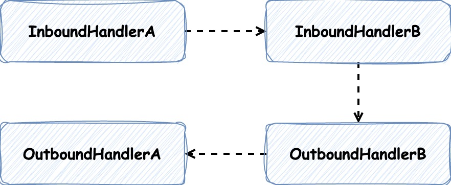

# 跟闪电侠学Netty：Netty即时聊天实战与底层原理

Netty是一个异步基于**事件驱动**的**高性能网络通信**框架

## 服务端启动流程

参考 NettyServer.java 

## 客户端启动流程

参考 NettyClient.java

### ChannelInboundHandlerAdapter 和 ChannelOutboundHandlerAdapter

在Netty框架里，每个连接对应着一个 `Channel`，而这个 `Channel` 的所有处理逻辑都在一个叫作 `ChannelPipeline` 的对象里。
`ChannelPipeline` 是一个双向链表，使用的是责任链模式，每个链表节点中封装着 `Handler`，并且可以获取Channel相关的上下文信息（ChannelHandlerContext）

有两种不同的Handler实现，分别用来处理读数据(ChannelInboundHandlerAdapter)和写数据(ChannelOutboundHandlerAdapter)，
如果Handler按如下顺序配置，它的执行逻辑顺序如下图所示

```java
serverBootstrap.group(boss, worker).channel(NioServerSocketChannel.class)
        .childHandler(new ChannelInitializer<NioSocketChannel>() {
            @Override
            protected void initChannel(NioSocketChannel ch) throws Exception {
                // 处理读数据的逻辑
                ch.pipeline().addLast(new InboundHandlerA()).addLast(new InboundHandlerB());

                // 处理写数据的逻辑
                ch.pipeline().addLast(new OutboundHandlerA()).addLast(new OutboundHandlerB());
            }
        });
```



InboundHandler的执行顺序与添加的责任链节点顺序一致，而OutboundHandler的执行顺序则相反。