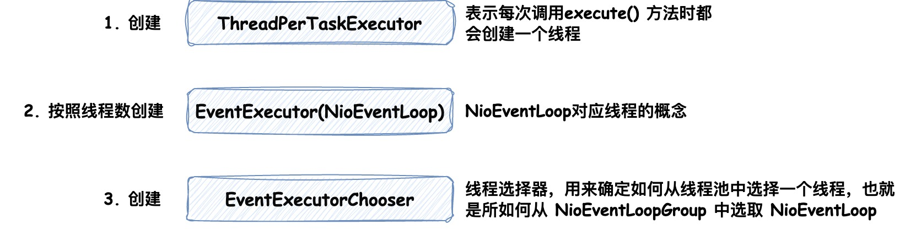

# 跟闪电侠学Netty：Netty即时聊天实战与底层原理

Netty是一个异步基于**事件驱动**的**高性能网络通信**框架，可以看做是对NIO和BIO的封装，并提供了简单易用的API、Handler和工具类等，
用以快速开发高性能、高可靠性的网络服务端和客户端程序。

### 1. 创建服务端

服务端启动需要创建 `ServerBootstrap` 对象，并完成**初始化线程模型**，**配置IO模型**和**添加业务处理逻辑（Handler）**。在添加业务处理逻辑时，
调用的是 `childHandler()` 方法添加了一个 `ChannelInitializer`，代码示例如下

```java
// 负责服务端的启动
ServerBootstrap serverBootstrap = new ServerBootstrap();

// 以下两个对象可以看做是两个线程组
// boss线程组负责监听端口，接受新的连接
NioEventLoopGroup boss = new NioEventLoopGroup();
// worker线程组负责读取数据
NioEventLoopGroup worker = new NioEventLoopGroup();

// 配置线程组并指定NIO模型
serverBootstrap.group(boss, worker).channel(NioServerSocketChannel.class)
        // 定义后续每个 新连接 的读写业务逻辑
        .childHandler(new ChannelInitializer<NioSocketChannel>() {
            @Override
            protected void initChannel(NioSocketChannel nioSocketChannel) throws Exception {
                nioSocketChannel.pipeline()
                        // 添加业务处理逻辑
                        .addLast(new SimpleChannelInboundHandler<String>() {
                            @Override
                            protected void channelRead0(ChannelHandlerContext channelHandlerContext, String msg) throws Exception {
                                System.out.println(msg);
                            }
                        });
            }
        });

// 绑定端口号
serverBootstrap.bind(2002);
```

通过调用 `.channel(NioServerSocketChannel.class)` 方法指定 `Channel` 类型为NIO类型，如果要指定为BIO类型，参数改成 `OioServerSocketChannel.class` 即可。

其中 `nioSocketChannel.pipeline()` 用来获取 `PipeLine` 对象，调用方法 `addLast()` 添加必要的业务处理逻辑，这里采用的是**责任链模式**，
会将每个Handler作为一个节点进行处理。

#### 1.1 创建客户端

客户端与服务端启动类似，不同的是，客户端需要创建 `Bootstrap` 对象来启动，并指定一个客户端线程组，
相同的是都需要完成**初始化线程模型**，**配置IO模型**和**添加业务处理逻辑（Handler）**， 代码示例如下

```java
// 负责客户端的启动
Bootstrap bootstrap = new Bootstrap();
// 客户端的线程模型
NioEventLoopGroup group = new NioEventLoopGroup();

// 指定线程组和NIO模型
bootstrap.group(group).channel(NioSocketChannel.class)
        // handler() 方法封装业务处理逻辑
        .handler(new ChannelInitializer<Channel>() {
            @Override
            protected void initChannel(Channel channel) throws Exception {
                channel.pipeline()
                    // 添加业务处理逻辑
                    .addLast(new SimpleChannelInboundHandler<String>() {
                            @Override
                            protected void channelRead0(ChannelHandlerContext channelHandlerContext, String msg) throws Exception {
                                System.out.println(msg);
                            }
                    });
            }
        });

// 连接服务端IP和端口
bootstrap.connect("127.0.0.1", 2002);
```

（注意：下文中内容均以服务端代码示例为准）

### 2. 编码和解码

客户端与服务端进行通信，通信的消息是以**二进制字节流**的形式通过 `Channel` 进行传递的，所以当我们在客户端封装好**Java业务对象**后，
需要将其按照协议转换成**字节数组**，并且当服务端接受到该**二进制字节流**时，需要将其根据协议再次解码成**Java业务对象**进行逻辑处理，
这就是**编码和解码**的过程。Netty 为我们提供了 `MessageToByteEncoder` 用于编码，`ByteToMessageDecoder` 用于解码。

#### 2.1 MessageToByteEncoder

用于将Java对象编码成字节数组并写入 `ByteBuf`，代码示例如下

```java
public class TcpEncoder extends MessageToByteEncoder<Message> {

    /**
     * 序列化器
     */
    private final Serializer serializer;

    public TcpEncoder(Serializer serializer) {
        this.serializer = serializer;
    }

    /**
     * 编码的执行逻辑
     *
     * @param message 需要被编码的消息对象
     * @param byteBuf 将字节数组写入ByteBuf
     */
    @Override
    protected void encode(ChannelHandlerContext channelHandlerContext, Message message, ByteBuf byteBuf) throws Exception {
        // 通过自定义的序列化器将对象转换成字节数组
        byte[] bytes = serializer.serialize(message);
        // 将字节数组写入 ByteBuf 便完成了对象的编码流程
        byteBuf.writeBytes(bytes);
    }
}
```

#### 2.2 ByteToMessageDecoder

它用于将接收到的二进制数据流解码成Java对象，与上述代码类似，只不过是将该过程反过来了而已，代码示例如下

```java
public class TcpDecoder extends ByteToMessageDecoder {
    /**
     * 序列化器
     */
    private final Serializer serializer;

    public TcpDecoder(Serializer serializer) {
        this.serializer = serializer;
    }

    /**
     * 解码的执行逻辑
     *
     * @param byteBuf 接收到的ByteBuf对象
     * @param list    任何完成解码的Java对象添加到该List中即可
     */
    @Override
    protected void decode(ChannelHandlerContext ctx, ByteBuf byteBuf, List<Object> list) throws Exception {
        // 根据协议自定义的解码逻辑将其解码成Java对象
        Message message = serializer.deSerialize(byteBuf);
        // 解码完成后添加到List中即可
        list.add(message);
    }
}
```

#### 2.3 注意要点

ByteBuf默认情况下使用的是**堆外内存**，不进行内存释放会发生内存溢出。不过 `ByteToMessageDecoder` 和 `MessageToByteEncoder` 这两个解码和编码
`Handler` 会自动帮我们完成内存释放的操作，无需再次手动释放。因为我们实现的 `encode()` 和 `decode()` 方法只是这两个 `Handler` 源码中执行的一个环节，
最终会在 finally 代码块中完成对内存的释放，具体内容可阅读 `MessageToByteEncoder` 中第99行 `write()` 方法源码。

#### 2.4 在服务端中添加编码解码Handler

```java
serverBootstrap.group(boss, worker).channel(NioServerSocketChannel.class)
        .childHandler(new ChannelInitializer<NioSocketChannel>() {
            @Override
            protected void initChannel(NioSocketChannel nioSocketChannel) throws Exception {
                nioSocketChannel.pipeline()
                        // 接收到请求时进行解码
                        .addLast(new TcpDecoder(serializer))
                        // 发送请求时进行编码
                        .addLast(new TcpEncoder(serializer));
            }
        });
```

### 3. 添加业务处理Handler

在Netty框架中，客户端与服务端的每个连接都对应着一个 `Channel`，而这个 `Channel` 的所有处理逻辑都封装在一个叫作 `ChannelPipeline` 的对象里。
`ChannelPipeline` 是一个双向链表，它使用的是**责任链模式**，每个链表节点都是一个 `Handler`，能通它能获取 `Channel` 相关的上下文信息(ChannelHandlerContext)。
Netty为我们提供了多种读取 `Channel` 中数据的 `Handler`，其中比较常用的是 `ChannelInboundHandlerAdapter` 和 `SimpleChannelInboundHandler`，
下文中我们以读取心跳消息为例。

#### 3.1 ChannelInboundHandlerAdapter

如下为处理心跳业务逻辑的 `Handler`，具体执行逻辑参考代码和注释即可

```java
public class HeartBeatHandler extends ChannelInboundHandlerAdapter {

    /**
     * channel中有数据可读时，会回调该方法
     *
     * @param msg 如果在该Handler前没有解码Handler节点处理，该对象类型为ByteBuf；否则为解码后的Java对象
     */
    @Override
    public void channelRead(ChannelHandlerContext ctx, Object msg) throws Exception {
        Message message = (Message) msg;
        // 处理心跳消息
        processHeartBeatMessage(message);

        // 初始化Ack消息
        Message ackMessage = initialAckMessage();
        // 回写给客户端
        ctx.channel().writeAndFlush(ackMessage);
    }
}
```

#### 3.2 SimpleChannelInboundHandler

`SimpleChannelInboundHandler` 是 `ChannelInboundHandlerAdapter` 的实现类，`SimpleChannelInboundHandler` 能够指定泛型，
这样在处理业务逻辑时，便**无需再添加上文代码中对象强转的逻辑**，这部分代码实现是在 `SimpleChannelInboundHandler` 的 `channelRead()` 方法中完成的，
它是一个模版方法，我们仅仅需要实现 `channelRead0()` 方法即可，代码示例如下

```java
public class HeartBeatHandler extends SimpleChannelInboundHandler<Message> {

    /**
     * @param msg 注意这里的对象类型即为 Message
     */
    @Override
    protected void channelRead0(ChannelHandlerContext ctx, Message msg) throws Exception {
        // 处理心跳消息
        processHeartBeatMessage(message);

        // 初始化Ack消息
        Message ackMessage = initialAckMessage();
        // 回写给客户端
        ctx.channel().writeAndFlush(ackMessage);
    }
}
```

#### 3.3 在服务端中添加心跳处理Handler

```java
serverBootstrap.group(boss, worker).channel(NioServerSocketChannel.class)
        .childHandler(new ChannelInitializer<NioSocketChannel>() {
            @Override
            protected void initChannel(NioSocketChannel nioSocketChannel) throws Exception {
                nioSocketChannel.pipeline()
                        // 接收到进行解码
                        .addLast(new TcpDecoder(serializer))
                        // 心跳业务处理Handler
                        .addLast(new HeartBeatHandler())
                        // 发送请求时进行编码
                        .addLast(new TcpEncoder(serializer));
            }
        });
```

### 4. ChannelHandler的生命周期

在 `ChannelInboundHandlerAdapter` 可以通过实现不同的方法来完成指定时机的方法回调，具体可参考如下代码

```java
public class LifeCycleHandler extends ChannelInboundHandlerAdapter {
    /**
     * 当检测到新连接之后，调用 ch.pipeline().addLast(...); 之后的回调
     * 表示当前channel中成功添加了 Handler
     */
    @Override
    public void handlerAdded(ChannelHandlerContext ctx) throws Exception {
        System.out.println("逻辑处理器被添加时回调：handlerAdded()");
        super.handlerAdded(ctx);
    }

    /**
     * 表示当前channel的所有逻辑处理已经和某个NIO线程建立了绑定关系
     * 这里的NIO线程通常指的是 NioEventLoop
     */
    @Override
    public void channelRegistered(ChannelHandlerContext ctx) throws Exception {
        System.out.println("channel 绑定到线程(NioEventLoop)时回调：channelRegistered()");
        super.channelRegistered(ctx);
    }

    /**
     * 当Channel的所有业务逻辑链准备完毕，连接被激活时
     */
    @Override
    public void channelActive(ChannelHandlerContext ctx) throws Exception {
        System.out.println("channel 准备就绪时回调：channelActive()");
        super.channelActive(ctx);
    }

    /**
     * 客户端向服务端发送数据，表示有数据可读时，就会回调该方法
     */
    @Override
    public void channelRead(ChannelHandlerContext ctx, Object msg) throws Exception {
        System.out.println("channel 有数据可读时回调：channelRead()");
        super.channelRead(ctx, msg);
    }

    /**
     * 服务端每完整的读完一次数据，都会回调该方法
     */
    @Override
    public void channelReadComplete(ChannelHandlerContext ctx) throws Exception {
        System.out.println("channel 某次数据读完时回调：channelReadComplete()");
        super.channelReadComplete(ctx);
    }

    // ---断开连接时---

    /**
     * 该客户端与服务端的连接被关闭时回调
     */
    @Override
    public void channelInactive(ChannelHandlerContext ctx) throws Exception {
        System.out.println("channel 被关闭时回调：channelInactive()");
        super.channelInactive(ctx);
    }

    /**
     * 对应的NIO线程移除了对这个连接的处理
     */
    @Override
    public void channelUnregistered(ChannelHandlerContext ctx) throws Exception {
        System.out.println("channel 取消线程(NioEventLoop) 的绑定时回调: channelUnregistered()");
        super.channelUnregistered(ctx);
    }

    /**
     * 为该连接添加的所有业务逻辑Handler被移除时
     */
    @Override
    public void handlerRemoved(ChannelHandlerContext ctx) throws Exception {
        System.out.println("逻辑处理器被移除时回调：handlerRemoved()");
        super.handlerRemoved(ctx);
    }
}
```

### 5. 解决粘包和半包问题

即使我们发送消息的时候是以 `ByteBuf` 的形式发送的，但是到了底层操作系统，仍然是以**字节流**的形式对数据进行发送的，而且服务端也以**字节流**的形式读取，
因此在服务端对字节流进行拼接时，可能就会造成发送时 `ByteBuf` 与读取时的 `ByteBuf` 不对等的情况，这就是所谓的粘包或半包现象。

以如下情况为例，当客户端频繁的向服务端发送心跳消息时，读取到的ByteBuf信息如下，其中一个心跳请求是用红框圈出的部分


可以发现多个心跳请求"粘"在了一起，那么我们需要对它进行拆包处理，否则只会读取第一条心跳请求，之后的请求会全部失效

Netty 为我们提供了基于长度的拆包器 `LengthFieldBasedFrameDecoder` 来进行拆包工作，它能对超过所需数据量的包进行拆分，
也能在数据不足的时候等待读取，直到数据足够时，构成一个完整的数据包并进行业务处理。

#### 5.1 LengthFieldBasedFrameDecoder

以标准接口文档中的协议（图示）为准，代码示例如下，其中的四个参数比较重要，详细信息可见注释描述


```java
public class SplitHandler extends LengthFieldBasedFrameDecoder {

    /**
     * 在协议中表示数据长度的字段在字节流首尾中的偏移量
     */
    private static final Integer LENGTH_FIELD_OFFSET = 10;

    /**
     * 表示数据长度的字节长度
     */
    private static final Integer LENGTH_FIELD_LENGTH = 4;

    /**
     * 数据长度后边的头信息中的字节偏移量
     */
    private static final Integer LENGTH_ADJUSTMENT = 10;

    /**
     * 表示从第一个字节开始需要舍去的字节数，在我们的协议中，不需要进行舍去
     */
    private static final Integer INITIAL_BYTES_TO_STRIP = 0;

    public SplitHandler() {
        super(Integer.MAX_VALUE, LENGTH_FIELD_OFFSET, LENGTH_FIELD_LENGTH, LENGTH_ADJUSTMENT, INITIAL_BYTES_TO_STRIP);
    }
}
```

之后将其添加到Handler中即可，如果遇到其他协议，更改其中参数或查看 `LengthFieldBasedFrameDecoder` 的JavaDoc中详细描述。

#### 5.2 在服务端中添加拆包Handler

```java
serverBootstrap.group(boss, worker).channel(NioServerSocketChannel.class)
        .childHandler(new ChannelInitializer<NioSocketChannel>() {
            @Override
            protected void initChannel(NioSocketChannel nioSocketChannel) throws Exception {
                nioSocketChannel.pipeline()
                    // 拆包Handler
                    .addLast(new SplitHandler())
                    // 接收到进行解码
                    .addLast(new TcpDecoder(serializer))
                    // 心跳业务处理Handler
                    .addLast(new HeartBeatHandler())
                    // 发送请求时进行编码
                    .addLast(new TcpEncoder(serializer));
            }
        });
```

### 6. Netty性能优化

#### 6.1 Handler对单例模式的应用

Netty 在每次有新连接到来的时候，都会调用 `ChannelInitializer` 的 `initChannel()` 方法，会将其中相关的 `Handler` 都创建一次，
如果其中的 `Handler` 是无状态且能够通用的，可以将其改成单例，这样就能够在每次连接建立时，避免多次创建相同的对象。

以如下服务端代码为例，包含如下Handler，可以将编码解码、以及业务处理Handler都定义成Spring单例bean的形式注入进来，
这样就能够完成对象的复用而无需每次建立连接都创建相同的对象了

```java
ServerBootstrap b = new ServerBootstrap();
b.group(bossGroup, workerGroup)
        .channel(NioServerSocketChannel.class)
        .childHandler(new ChannelInitializer<SocketChannel>() {
            @Override
            public void initChannel(SocketChannel ch) throws Exception {
                ch.pipeline()
                        // 拆包Handler
                        .addLast(new SplitHandler())
                        // 日志Handler
                        .addLast(new LoggingHandler(LogLevel.INFO))
                        // 解码Handler
                        .addLast(new TcpDecoder(serializer))
                        // 心跳、格口状态、设备状态、RFID上报、扫码上报和分拣结果上报Handler
                        .addLast(new HeartBeatHandler(), new ChuteStatusHandler())
                        .addLast(new DeviceStatusReceiveHandler(), new RfidBindReceiveHandler())
                        .addLast(new ScanReceiveHandler(), new SortResultHandler())
                        // 编码Handler
                        .addLast(new TcpEncoder(serializer));
            }
        });
```

改造完成后如下

```java
ServerBootstrap b = new ServerBootstrap();
b.group(bossGroup, workerGroup)
        .channel(NioServerSocketChannel.class)
        .childHandler(new ChannelInitializer<SocketChannel>() {
            @Override
            public void initChannel(SocketChannel ch) throws Exception {
                ch.pipeline()
                        // 拆包Handler
                        .addLast(new SplitHandler())
                        // 日志Handler
                        .addLast(new LoggingHandler(LogLevel.INFO))
                        // 解码Handler
                        .addLast(tcpDecoder)
                        // 心跳、格口状态、设备状态、RFID上报、扫码上报和分拣结果上报Handler
                        .addLast(heartBeatHandler, chuteStatusHandler)
                        .addLast(deviceStatusReceiveHandler, rfidBindReceiveHandler)
                        .addLast(scanReceiveHandler, sortResultHandler)
                        // 编码Handler
                        .addLast(tcpEncoder);
            }
        });
```

不过需要注意在每个单例Handler的类上标注 `@ChannelHandler.Sharable` 注解，否则会抛出如下异常

`io.netty.channel.ChannelPipelineException: netty.book.practice.handler.server.LoginHandler is not a @Sharable handler, 
so can't be added or removed multiple times`

另外，`SplitHanlder` 不能进行单例处理，因为它的内部实现与每个 `Channel` 都有关，每个 `SplitHandler` 都需要维持每个 `Channel` 读到的数据，
即它是**有状态的**。

#### 6.2 缩短责任链调用

对服务端来说，每次解码出来的Java对象在多个业务处理 `Handler` 中只会经过一个其中 `Handler` 完成业务处理，那么我们将所有业务相关的 `Handler`
封装起来到一个Map中，每次只让它经过必要的Handler而不是经过整个责任链，那么便可以提高Netty处理请求的性能。

定义如下 `ServerHandlers` 单例bean，并使用 **策略模式** 将对应的 `Handler` 管理起来，每次处理时根据消息类型获取对应的 `Handler` 来完成业务逻辑

```java
@ChannelHandler.Sharable
public class ServerHandlers extends SimpleChannelInboundHandler<Message> {

    @Resourse
    private HeartBeatHandler heartBeatHandler;

    /**
     * 策略模式封装Handler，这样就能在回调 ServerHandler 的 channelRead0 方法时
     * 找到具体的Handler，而不需要经过责任链的每个 Handler 节点，以此来提高性能
     */
    private final Map<Command, SimpleChannelInboundHandler<Message>> map;

    public ServerHandler() {
        map = new HashMap<>();

        // key: 消息类型枚举 value: 对应的Handler
        map.put(MessageType.HEART_BEAT, heartBeatHandler);
        // ...
    }

    @Override
    protected void channelRead0(ChannelHandlerContext ctx, Message msg) throws Exception {
        // 调用 channelRead() 方法完成业务逻辑处理
        map.get(msg.getMessageType()).channelRead(ctx, msg);
    }
}
```

改造完成后，服务端代码如下，因为我们封装了平行的业务处理 `Handler`，所以代码很清爽

```java
ServerBootstrap b = new ServerBootstrap();
b.group(bossGroup, workerGroup)
        .channel(NioServerSocketChannel.class)
        .childHandler(new ChannelInitializer<SocketChannel>() {
            @Override
            public void initChannel(SocketChannel ch) throws Exception {
                ch.pipeline()
                        // 拆包Handler
                        .addLast(new SplitHandler())
                        // 日志Handler
                        .addLast(new LoggingHandler(LogLevel.INFO))
                        // 解码Handler
                        .addLast(tcpDecoder)
                        // serverHandlers 封装了 心跳、格口状态、设备状态、RFID上报、扫码上报和分拣结果上报Handler
                        .addLast(serverHandlers)
                        // 编码Handler
                        .addLast(tcpEncoder);
            }
        });
```

#### 6.3 合并编码、解码Handler

Netty 对编码解码提供了统一处理Handler是`MessageToMessageCodec`，这样我们就能将编码和解码的Handler合并成一个添加接口，代码示例如下

```java
@ChannelHandler.Sharable
public class MessageCodecHandler extends MessageToMessageCodec<ByteBuf, Message> {

    /**
     * 序列化器
     */
    @Resourse
    private Serializer serializer;

    @Override
    protected void encode(ChannelHandlerContext ctx, Message msg, List<Object> out) throws Exception {
        // 将字节数组写入 ByteBuf 
        ByteBuf byteBuf = ctx.alloc().ioBuffer();
        serializer.serialize(byteBuf, msg);

        // 这个编码也需要添加到List中
        out.add(byteBuf);
    }

    @Override
    protected void decode(ChannelHandlerContext ctx, ByteBuf msg, List<Object> out) {
        // 根据协议自定义的解码逻辑将其解码成Java对象，并添加到List中
        out.add(serializer.deSerialize(msg));
    }
}
```

改造完成后，服务端代码如下，将其放在业务处理Handler前即可，调用完业务Handler逻辑，会执行编码逻辑

```java
ServerBootstrap b = new ServerBootstrap();
b.group(bossGroup, workerGroup)
        .channel(NioServerSocketChannel.class)
        .childHandler(new ChannelInitializer<SocketChannel>() {
            @Override
            public void initChannel(SocketChannel ch) throws Exception {
                ch.pipeline()
                        // 拆包Handler
                        .addLast(new SplitHandler())
                        // 日志Handler
                        .addLast(new LoggingHandler(LogLevel.INFO))
                        // 解码、编码Handler
                        .addLast(messageCodecHandler)
                        // serverHandlers 封装了 心跳、格口状态、设备状态、RFID上报、扫码上报和分拣结果上报Handler
                        .addLast(serverHandlers);
            }
        });
```

#### 6.4 减少NIO线程阻塞

对于耗时的业务操作，需要将它们都丢到**业务线程池中去处理**，因为单个NIO线程会管理很多 `Channel` ，
只要有一个 `Channel` 中的 `Handler` 的 `channelRead()` 方法被业务逻辑阻塞，那么它就会拖慢绑定在该NIO线程上的其他所有 `Channel`。

为了避免上述情况，可以在包含长时间业务处理逻辑的Handler中创建一个线程池，并将其丢入线程池中进行执行，伪代码如下

```java
protected void channelRead(ChannelHandlerContext ctx, Object message) {
    threadPool.submit(new Runnable() {
        // 耗时的业务处理逻辑
        doSomethingSependTooMuchTime();
        
        writeAndFlush();
    });
}
```

#### 6.5 空闲"假死"检测Handler

如果底层的TCP连接已经断开，但是另一端服务并没有捕获到，在某一端（客户端或服务端）看来会认为这条连接仍然存在，这就是**连接"假死"现象**。
这造成的问题就是，对于服务端来说，每个连接连接都会耗费CPU和内存资源，过多的假死连接会造成性能下降和服务崩溃；对客户端来说，
连接假死会使得发往服务端的请求都会超时，所以需要尽可能避免假死现象的发生。

造成假死的原因可能是公网丢包、客户端或服务端网络故障等，Netty为我们提供了 `IdleStateHandler` 来解决超时假死问题，示例代码如下

```java
public class MyIdleStateHandler extends IdleStateHandler {

    private static final int READER_IDLE_TIME = 15;

    public MyIdleStateHandler() {
        // 读超时时间、写超时时间、读写超时时间 指定0值不判断超时
        super(READER_IDLE_TIME, 0, 0, TimeUnit.SECONDS);
    }

    @Override
    protected void channelIdle(ChannelHandlerContext ctx, IdleStateEvent evt) {
        System.out.println(READER_IDLE_TIME + "秒内没有读到数据，关闭连接");
        ctx.channel().close();
    }
}
```

其构造方法中有三个参数来分别指定读、写和读写超时时间，当指定0时不判断超时，除此之外Netty也有专门用来处理读和写超时的Handler，
分别为 `ReadTimeoutHandler`, `WriteTimeoutHandler`。

将其添加到服务端 `Handler` 的首位即可

```java
ServerBootstrap b = new ServerBootstrap();
b.group(bossGroup, workerGroup)
        .channel(NioServerSocketChannel.class)
        .childHandler(new ChannelInitializer<SocketChannel>() {
            @Override
            public void initChannel(SocketChannel ch) throws Exception {
                ch.pipeline()
                        // 超时判断Handler
                        .addLast(new MyIdleStateHandler())
                        // 拆包Handler
                        .addLast(new SplitHandler())
                        // 日志Handler
                        .addLast(new LoggingHandler(LogLevel.INFO))
                        // 解码、编码Handler
                        .addLast(messageCodecHandler)
                        // serverHandlers 封装了 心跳、格口状态、设备状态、RFID上报、扫码上报和分拣结果上报Handler
                        .addLast(serverHandlers);
            }
        });
```

### 7. ChannelPipeline

`ChannelPipeline` 与 `Channel` 密切相关，它可以看做是一条流水线，数据以字节流的形式进来，经过不同 `Handler` 的"加工处理"，
最终以字节流的形式输出。`ChannelPipeline` 在每条新连接建立的时候被创建，是一条双向链表，其中每一个节点都是 `ChannelHadnlerContext` 对象，
能够通过它拿到相关的上下文信息，默认它有头节点 `HeadContext` 和尾结点 `TailContext`。

#### 7.1 InboundHandler 和 OutboundHandler

定义在 `ChannelPipeline` 中的 Handler 是**可插拔**的，能够完成动态编织，调用 `ctx.pipeline().remove()` 方法可移除，
调用 `ctx.pipeline().addXxx()` 方法可进行添加。

`InboundHandler` 与 `OutboundHandler` 处理的事件不同，前者处理 `Inbound事件`，典型的就是读取数据流并加工处理；
后者会对调用 `writeAndFlush()` 方法的 `Outbound事件` 进行处理。

此外，两者的传播机制也是不同的：

`InboundHandler` 会从链表头逐个向下调用，头节点只是简单的将该事件传播下去(`ctx.fireChannelRead(mug)`)，
执行过程中调用 `findContextInbound()` 方法来寻找 `InboundHandler` 节点，直到 `TailContext` 节点执行方法完毕，结束调用。
一般自定义的 `ChannelInboundHandler` 都继承自 `ChannelInboundHandlerAdapter`， 如果没有覆盖 `channelXxx()` 相关方法，
那么该事件正常会遍历双向链表一直传播到尾结点，否则就会在当前节点执行完结束；当然也可以调用 `fireXxx()` 方法让事件从当前节点继续向下传播。

`OutboundHandler` 是**从链表尾向链表头**调用，相当于反向遍历 `ChannelPipeline` 双向链表，`Outbound事件` 会先经过 `TailContext` 尾节点，
并在执行过程中不断寻找 `OutboundHandler` 节点加工处理，直到头节点 `HeadContext` 调用 `Unsafe.write()` 方法结束。

#### 7.2 异常传播

异常的传播机制和 `Inbound事件` 的传播机制类似，在**任何节点发生的异常都会向下一个节点传递**。
如果自定义的 Handler 没有处理异常也没有实现 `exceptionCaught()` 方法，最终则会落到 `TailContext` 节点，控制台打印异常未处理的警告信息。

通常异常处理，我们会定义一个异常处理器，继承自 `ChannelDuplexHandler` ，放在自定义**链表节点的末尾**，这样就能够一定捕获和处理异常。

### 8. Reactor线程模型

#### 8.1 NioEventLoopGroup

创建 `new NioEventLoopGroup()` 它的默认线程数是当前CPU线程数的**2倍**，最终会调用到如下源码

```java
// 这里计算的线程数量
private static final int DEFAULT_EVENT_LOOP_THREADS = Math.max(1, SystemPropertyUtil.getInt(
        "io.netty.eventLoopThreads", Runtime.getRuntime().availableProcessors() * 2));

protected MultithreadEventLoopGroup(int nThreads, Executor executor, Object... args) {
    super(nThreads == 0 ? DEFAULT_EVENT_LOOP_THREADS : nThreads, executor, args);
}
```

跟进到构造方法的最终实现，会执行如下业务逻辑



其中在第2步创建 `NioEventLoop` 时，值得关注的是创建了一个 `Selector`，以此来实现IO多路复用；另外它还创建了高性能 `MPSC`（多生产者单消费者）队列，
借助它来协调任务的异步执行，如此单条线程（NioEventLoop）、Selector和MPSC它们三者是**一对一**的关系。而每条连接都对应一个 `Channel`，
每个 `Channel` 都绑定唯一一个 `NioEventLoop`，因此单个连接的所有操作都是在一个线程中执行，是线程安全的。

第3步骤创建**线程选择器**，它的作用是为连接在 `NioEventLoopGroup` 中选择一个 `NioEventLoop`，并将该连接与 `NioEventLoop` 中的 `Selector` 完成绑定。
在底层有两种选择器的实现，分别是 `PowerOfTowEventExecutorChooser` 和 `GenericEventExecutorChooser`，它们的原理都是从线程池里循环选择线程，
不同的是前者计算循环的索引采用的是**位运算**而后者采用的是**取余运算**。

#### 8.2 Reactor线程 select 操作

源码位置 `NioEventLoop` 的 `run()` 方法， `select` 操作会**不断轮询是否有IO事件发生**，并且在轮询过程中不断检查是否有任务需要执行，
保证Netty任务队列中的任务能够及时执行，轮询过程使用一个计数器避开了 JDK 的空轮询Bug

#### 8.3 处理产生IO事件的Channel

在 Netty 的 `Channel` 中，有两大类型的 `Channel`，一个是 `NioServerSocketChannel`，由 boss NioEventLoop 处理；
另一个是 `NioSocketChannel`，由worker NioEventLoop 处理，所以

1. 对于 boss NioEventLoop 来说，轮询到的是连接事件，后续通过 NioServerSocketChannel 的 Pipeline 将连接交给一个 work NioEventLoop 处理
2. 对于 work NioEventLoop 来说，轮询到的是读写事件，后续通过 NioSocketChannel 的 Pipeline 将读取到的数据传递给每个 ChannelHandler 处理

注意任务的执行都是**异步**的。

#### 8.4 任务的收集和执行

上文中提到了我们创建了高性能的`MPSC`队列，它是用来**聚集**非Reactor线程创建的任务的，`NioEventLoop` 会在执行的过程中不断检测是否有事件发生，
如果有事件发生就处理，处理完事件之后再处理非Reactor线程创建的任务。**在检测是否有事件发生的时候**，为了保证异步任务的及时处理，只要有任务要处理，
就会停止任务检测，去处理任务，处理任务时是Reactor单线程执行。

#### 8.5 注册连接的流程

当 boss Reactor线程检测到 ACCEPT 事件之后，创建一个 `NioSocketChannel`，并把用户设置的 ChannelOption(Option参数配置)、ChannelAttr(Channel 参数)、
ChannelHandler(ChannelInitializer)封装到 `NioSocketChannel` 中。接着，使用线程选择器在 `NioEventLoopGroup` 中选择一条 `NioEventLoop` (线程)，
把 `NioSocketChannel` 中包装的JDK Channel 当做Key，自身（NioSocketChannel）作为 attachment，注册 NioEventLoop 对应的 Selector上。
这样，后续有读写事件发生，就可以直接获取 attachment 来处理读写数据的逻辑。

#### 8.6 如何理解IO多路复用

简单地说：IO多路复用是指**可以在一个线程内处理多个连接的IO事件请求**。以Java中的IO多路复用为例，
服务端创建 `Selector` 对象不断的调用 `select()` 方法来处理各个连接上的IO事件，
之后将这些IO事件交给任务线程异步去执行，这就达到了在一个线程内同时处理多个连接的IO请求事件的目的。

### 巨人的肩膀

- 《Netty即时聊天实战与底层原理》